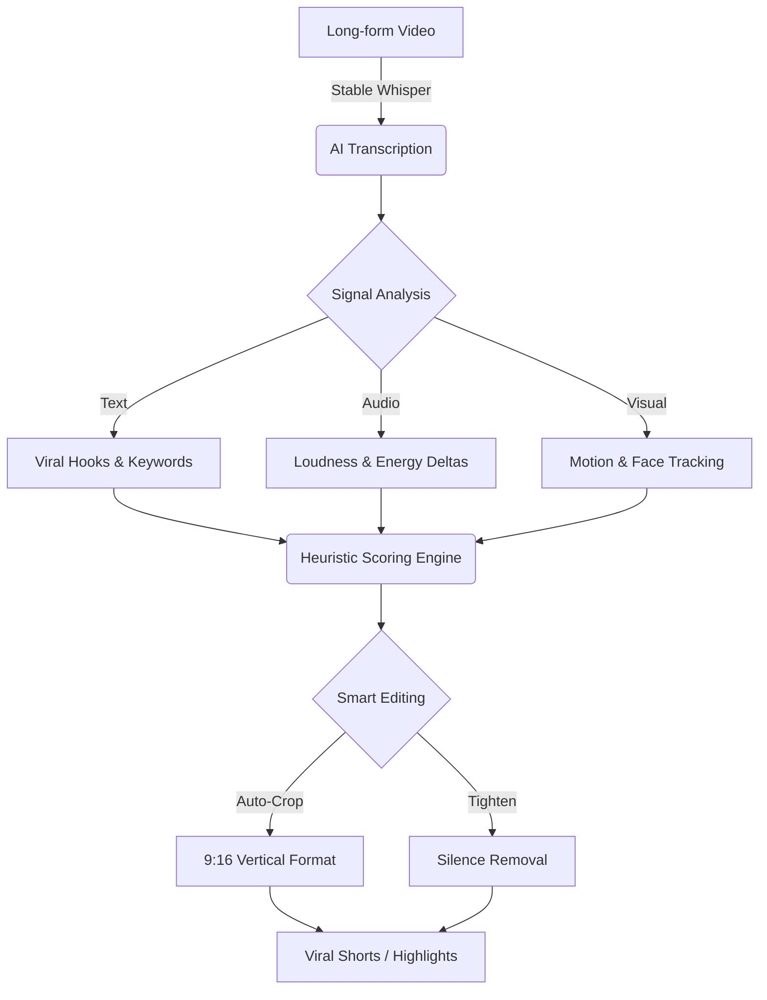

# ⚡ ShortsFlow

> **An AI system that runs an entire YouTube Shorts channel — on autopilot.**

[](https://python.org)
[](https://nextjs.org)
[](https://supabase.com)
[](https://ffmpeg.org)

Welcome to **ShortsFlow**, an end-to-end content automation system. It doesn't just generate text; it **writes the script → generates the voice → composes the video → uploads to YouTube, Instagram & Pinterest.**

---

## 🔥 At a Glance
- **🚀 AI Clip Extraction**: Turn hours of long-form video (Podcasts, Gaming, Vlogs) into a series of high-impact, viral-ready shorts automatically.
- **🤖 Dual LLM Support**: Use Cloud APIs (OpenAI, Hugging Face) or run locally (Ollama, local LLMs) for maximum privacy and $0 cost.
- **✨ Smart Editing**: AI-driven face tracking (Haar Cascades), auto-cropping, and silence removal.
- **🎬 12+ Viral Modes**: Interactive Facts (2 Truths, 1 Lie), News, Cosmic (JWST), Trivia, and more.
- **☁️ Automated Pipeline**: Fully automated rendering and scheduling via GitHub Actions.
- **💳 SaaS Foundation**: Integrated Authentication via Supabase and Payment ready via Stripe.

---

## ✂️ AI Powered Clipping (Long-form to Shorts)
This is the core power of ShortsFlow. Give it a 2-hour podcast, and it will return the top 10 most viral moments.



**How it works:**
1.  **AI Analysis**: Scans transcripts for high-energy segments, viral hook keywords, and narrative peaks.
2.  **Audio/Visual Signals**: Uses energy deltas and motion tracking to find "loud" or "active" moments.
3.  **Auto-Crop**: Dynamically tracks faces and centers them for vertical 9:16 format.
4.  **Silence Stripping**: Automatically removes "uhms", "ahs", and dead air to keep pacing fast.

```bash
# Extract the top 5 viral clips from a long video
python main.py --source_video "./podcast.mp4" --clip_count 5 --smart_crop --tighten
```

---

## 🎬 Content Modes
Every format is a complete, standalone short — scripted, voiced, and composed entirely by AI.

| Mode | What It Is |
|---|---|
| 🕵️ **Investigator** | Mystery-framed facts — 2 truths, 1 lie, comment to find out |
| 📖 **Story** | First-person AI story in a consistent narrator voice |
| 🧩 **Riddle** | Lateral thinking challenge designed to drive comments |
| 🤔 **Would You Rather** | Split-screen dilemma with dual atmospheric backgrounds |
| 📰 **News** | Real RSS headlines rewritten by AI with cartoon personas |
| 💬 **Reddit Story** | Dramatic first-person AITA-style story with moral conflict |
| 🎯 **Find It** | Visual challenge — spot the hidden target among distractors |
| 🔢 **Odd One Out** | Spot the item that doesn't belong |
| 🔊 **Guess The Sound** | Audio challenge with mystery reveal |
| 🧠 **Trivia** | Single question, 3 options, dramatic reveal |
| 💬 **Quote** | Deep cinematic quote over moody footage |
| 🌌 **JWST** | Mind-blowing space facts using the latest James Webb images |

---

## 📂 Project Structure
- `engine/`: Core Python modules for Scripting, Voiceover, and FFmpeg Compositing.
- `web/`: Next.js 14 Dashboard, API routes, and Supabase integration.
- `scripts/`: Development utilities, seeding tools, and testing scripts.
- `samples/`: Archive of generated video samples and text logs.
- `main.py`: Primary entry point for local generation and CI/CD workers.

---

## 🛠️ Getting Started

### 1. Prerequisites
- Python 3.12+
- FFmpeg (installed and added to your PATH)
- Node.js 18+

### 2. Basic Setup
```bash
# Install engine dependencies
pip install -r requirements.txt

# Rename and fill env variables
cp .env.example .env

# Generate a video manually
python main.py --mode FACTS --category history
```

---

## ☁️ Zero-Cost Cloud Setup
- **Frontend**: Hosted on Vercel.
- **Heavy Rendering**: Powered by GitHub Actions (Free tier capacity).
- **Database/Auth**: Powered by Supabase.

---

## 🔐 Configuration
Rename `.env.example` to `.env` and configure your preferences:

### LLM Options (Choose One or Both)
- **Cloud (Hugging Face)**: Set `HF_API_KEY` for high-speed generation.
- **Local (Ollama)**: Set `LOCAL_LLM_URL=http://localhost:11434/api/chat` to run entirely on your own GPU/CPU for free.

### Media & SaaS Keys
- `PEXELS_API_KEY`: Pexels (Stock Media)
- `STRIPE_SECRET_KEY`: Stripe (Payments)
- `NEXT_PUBLIC_SUPABASE_URL`: Supabase (Auth/Database)

---

## ⚖️ License
License

This project is licensed under the MIT License.

You may use, modify, distribute, and use this project commercially, including for monetized YouTube channels, YouTube Shorts, SaaS applications, client projects, and paid services.
