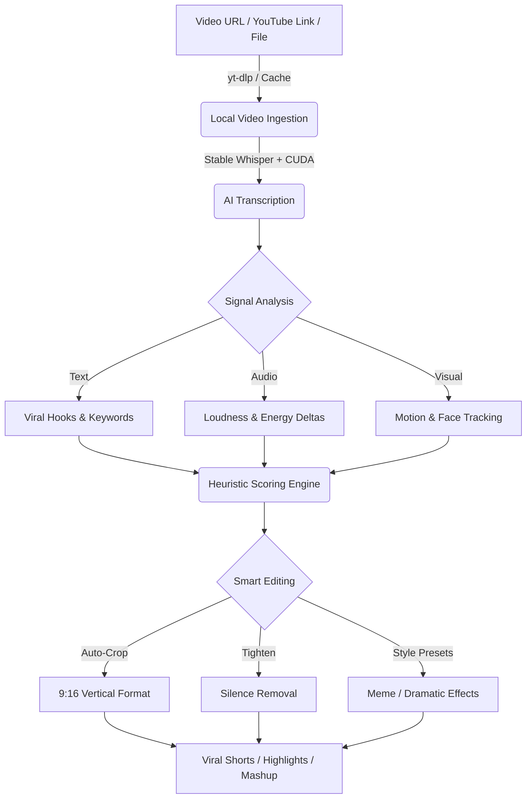

# ⚡ ShortsFlow

> **An AI system that runs an entire YouTube Shorts channel — on autopilot.**

[](https://python.org)
[](https://nextjs.org)
[](https://supabase.com)
[](https://ffmpeg.org)

Welcome to **ShortsFlow**, an end-to-end content automation system. It doesn't just generate text; it **writes the script → generates the voice → composes the video → uploads to YouTube, Instagram & Pinterest.**

---

## 🔥 At a Glance
- **🚀 AI Clip Extraction**: Turn long-form videos or YouTube links (Podcasts, Gaming, Vlogs) into a series of high-impact, viral-ready shorts automatically.
- **📥 Direct Video URL Ingestion & Caching**: Pass any YouTube, Twitch, TikTok, Twitter/X, or direct video link (`--source_video "https://..."`). Built-in persistent caching prevents re-downloading.
- **⚡ GPU (CUDA) Acceleration**: Native PyTorch CUDA acceleration for 10x faster Whisper transcriptions and high-speed FFmpeg processing.
- **🤖 Dual LLM Support**: Use Cloud APIs (Gemini, OpenAI, Hugging Face) or run locally (Ollama, local LLMs) for maximum privacy and $0 cost.
- **✨ Smart Editing**: AI-driven face tracking (Haar Cascades), auto-cropping, style presets (`--style meme`), and silence removal (`--tighten`).
- **🎬 15+ Content & Explainer Modes**: Interactive Facts, Stories, Riddles, Manim Educational Explanations (`EXPLAINER`), AI Music, Trivia, and more.
- **☁️ Automated Pipeline**: Fully automated rendering and scheduling via GitHub Actions.
- **💳 SaaS Foundation**: Integrated Next.js 14 Dashboard with Supabase Auth and Stripe payments.

---

## ✂️ AI Powered Clipping (YouTube / Video URL or Local File)
This is the core power of ShortsFlow. Pass a local video path **or a YouTube URL**, and it will extract the top viral moments.



### Usage Examples

```bash
# 1. Extract shorts from a YouTube video with CUDA GPU & Smart Crop
py -3.12 main.py --source_video "https://www.youtube.com/watch?v=..." --extract_mode shorts --clip_count 3 --smart_crop --tighten

# 2. Extract with Meme style editing & custom clip target duration
py -3.12 main.py --source_video "./podcast.mp4" --clip_count 5 --target_duration 30 --style meme --smart_crop --tighten

# 3. Create a single combined Highlight Reel / Mashup
py -3.12 main.py --source_video "https://www.youtube.com/watch?v=..." --extract_mode shorts --mashup --smart_crop --tighten
```

> **Note on GPU Acceleration**: Make sure PyTorch with CUDA support is installed (`torch.cuda.is_available() == True`) for maximum Whisper transcription speed.

---

## 🎬 Content & Animation Modes
Every format is a complete, standalone short — scripted, voiced, animated, and composed entirely by AI.

| Mode | What It Is |
|---|---|
| 📺 **AI Extraction** | Turn YouTube links or local videos into viral shorts |
| 🧮 **Explainer (Manim)** | Automated educational math, science, and coding animations |
| 🎵 **Music** | AI-generated music tracks with dynamic visual themes |
| 🕵️ **Investigator** | Mystery-framed facts — 2 truths, 1 lie, comment to find out |
| 📖 **Story** | First-person AI story in a consistent narrator voice |
| 🧩 **Riddle** | Lateral thinking challenge designed to drive comments |
| 🤔 **Would You Rather** | Split-screen dilemma with dual atmospheric backgrounds |
| 📰 **News** | Real RSS headlines rewritten by AI with cartoon personas |
| 💬 **Reddit Story** | Dramatic first-person AITA-style story with moral conflict |
| 🎯 **Find It** | Visual challenge — spot the hidden target among distractors |
| 🔢 **Odd One Out** | Spot the item that doesn't belong |
| 🔊 **Guess The Sound** | Audio challenge with mystery reveal |
| 🧠 **Trivia** | Single question, 3 options, dramatic reveal |
| 💬 **Quote** | Deep cinematic quote over moody footage |
| 🌌 **JWST** | Mind-blowing space facts using the latest James Webb images |

---

## 📂 Project Structure
- `engine/`: Core Python modules for Scripting, Voiceover, Analysis, Media Generation, and FFmpeg/Manim Compositing.
- `web/`: Next.js 14 Dashboard, API routes, and Supabase integration.
- `scripts/`: Development utilities, seeding tools, and testing scripts.
- `remotion-video/`: Remotion React-based video animation compositions.
- `samples/`: Archive of generated video samples and text logs.
- `main.py`: Primary CLI entry point and backend process router.

---

## 🛠️ Getting Started

### 1. Prerequisites
- Python 3.12+ (with PyTorch CUDA for GPU support)
- FFmpeg (installed and added to your PATH)
- Node.js 18+

### 2. Basic Setup
```bash
# Install engine dependencies
pip install -r requirements.txt

# Setup environment variables
cp .env.example .env

# Generate a video manually
py -3.12 main.py --mode FACTS --category history
```

---

## ☁️ Zero-Cost Cloud Setup
- **Frontend**: Hosted on Vercel.
- **Heavy Rendering**: Powered by GitHub Actions (Free tier capacity).
- **Database/Auth**: Powered by Supabase.

---

## 🔐 Configuration
Rename `.env.example` to `.env` and configure your preferences:

### LLM Options (Choose One or Both)
- **Cloud (Hugging Face)**: Set `HF_API_KEY` for high-speed generation.
- **Local (Ollama)**: Set `LOCAL_LLM_URL=http://localhost:11434/api/chat` to run entirely on your own GPU/CPU for free.

### Media & SaaS Keys
- `PEXELS_API_KEY`: Pexels (Stock Media)
- `STRIPE_SECRET_KEY`: Stripe (Payments)
- `NEXT_PUBLIC_SUPABASE_URL`: Supabase (Auth/Database)

---

## ⚖️ License
This project is licensed under the **CC BY-NC-SA 4.0** (Attribution-NonCommercial-ShareAlike). See the [LICENSE](file:///c:/Users/win10/.gemini/antigravity/scratch/shorts-generator/LICENSE) file for details.
