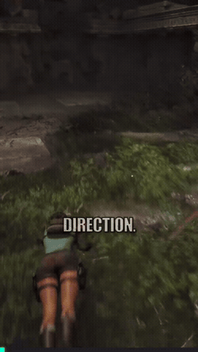
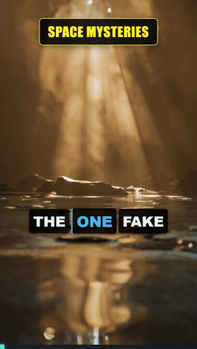
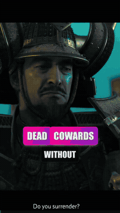
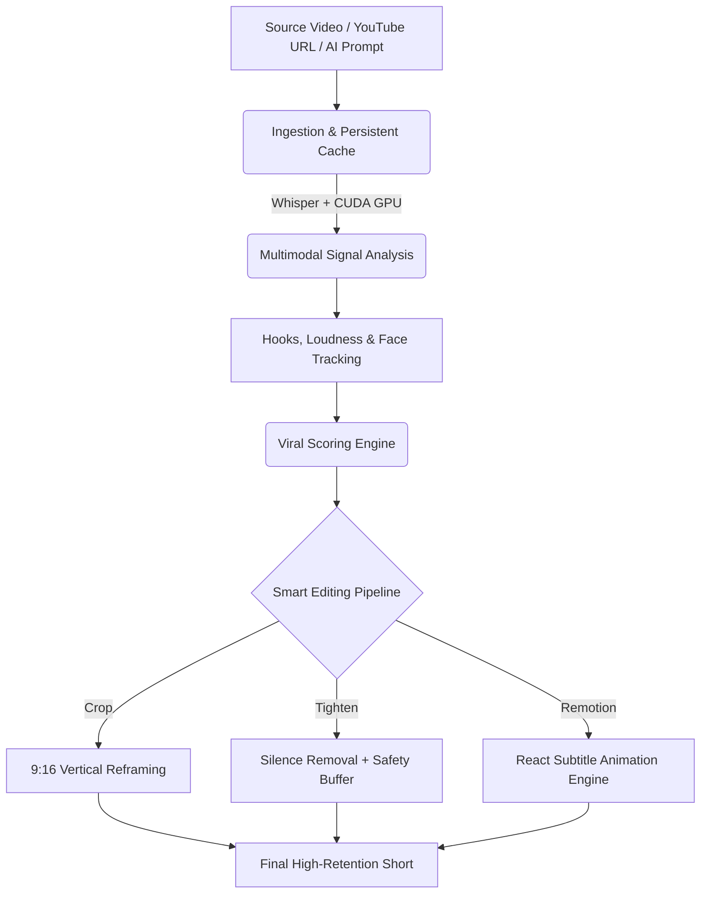

# ⚡ ShortsFlow AI Studio

> **The Open-Source Opus Clip Alternative**
> Turn Long Videos, YouTube Links, or AI Concepts into High-Retention 9:16 Shorts on Autopilot.

<div align="center">
  
  
  
</div>

[](https://python.org)
[](https://remotion.dev)
[](https://nvidia.com)
[](https://github.com/ghost1412/shorts-generator)
[](LICENSE)

---

## ⚡ ShortsFlow vs Paid SaaS Tools

| Feature | ⚡ ShortsFlow AI Studio (Open Source) | 💳 Opus Clip / Paid SaaS ($20–$50/mo) |
|---|---|---|
| **Monthly Cost** | **$0 / 100% Free Forever** | $19 – $49 / month |
| **Data Privacy** | **100% Local GPU / Private** | Your videos uploaded to 3rd party cloud |
| **Creation Modes** | **AI Clipping + Manim Explainers + Facts + Riddles + WYR** | Video clipping only |
| **Subtitle Quality** | **Remotion React Spring Physics (Hormozi, Glow Box, Bounce)** | Basic cloud subtitles |
| **Limits & Watermarks** | **Unlimited Exports & Zero Watermarks** | Monthly credit caps & paid watermark removals |
| **AI LLM Flexibility** | **Google Gemini, Local Ollama (Qwen/Llama), HuggingFace** | Locked cloud AI models |

> ⭐ **If ShortsFlow saves you $240+/year on video clipping subscriptions, drop a star on the repo to support independent open-source AI!**

---

## ⚡ Quick Start (Get Your First Video in 60 Seconds)

### 1-Click Automated Setup (Windows)

```bash
# ⚡ 1-Click Fast Clone (~16.5 MB)
git clone --depth 1 https://github.com/ghost1412/shorts-generator.git
cd shorts-generator

# Run 1-Click Setup 
setup.bat

# Launch Desktop GUI Studio
launch.bat
```

### 🐧 Linux & macOS Setup

```bash
# ⚡ 1-Click Fast Clone (~16.5 MB)
git clone --depth 1 https://github.com/ghost1412/shorts-generator.git
cd shorts-generator

chmod +x setup.sh
./setup.sh

# Launch Desktop GUI or CLI
python3 gui_app.py
```

### 🐳 Docker Quickstart (Self-Hosted)

```bash
docker compose up -d
```

---

## 🔥 Key Features

- **🚀 AI Video Extraction & URL Ingestion**: Paste any YouTube link, Podcast URL, or local file. ShortsFlow detects viral hooks, energy shifts, and key moments using multimodal AI analysis.
- **🎨 Visual Filters & Color Grading**: Apply 12 custom aesthetic color grades (`kurosawa`, `teal_orange`, `cyberpunk`, `cinematic_warm`, `vibrant_action`, `vintage_vhs`, `moody_dark`, `anime_vivid`, `matrix_green`, `sepia_western`, `cold_thriller`, `hdr_pop`) or use `--video_filter auto` / `--video_filter dynamic` to let AI automatically grade video scenes.
  
  

- **🧠 AI Dynamic Scene Filtering (`--video_filter dynamic`)**: AI analyzes video timestamps and transitions between different visual filters across scene phases in a single pass.
- **🎞️ Standalone Filter Mode (`--mode FILTER`)**: Apply color grading filters directly to any video file without cutting or reframing.
- **💬 4 Subtitle Style Presets**:
  - `HORMOZI`: Dynamic word spring pop, black strokes, multi-color neon highlights (`#39FF14`, `#FFEA00`, `#00E5FF`).
  - `GLOW_BOX`: Glassmorphic gradient pill box around active phrases with neon glow.
  - `BOUNCE`: Upward jump animation with intense drop-shadow text glow.
  - `MINIMAL`: Crisp dark translucent box with accent border.
- **🎯 Smart Crop & Anti-Blinking Face Tracking**: Intelligent face detection with Exponential Moving Average (EMA) smoothing and velocity clamping to prevent camera jitter.
- **✂️ Padded Silence Removal**: Auto-tighten audio gaps with an 80ms safety buffer to ensure zero word truncation or sub-frame flickering.
- **🤖 Multi-LLM Fallback Architecture**: Seamlessly switches between **Google Gemini API**, **Local Ollama (Qwen/Llama)**, and **HuggingFace** for 100% uptime and $0 local cost option.
- **🧮 Standalone Creation Modes**:
  - `EXPLAINER`: Automated educational math & coding animations powered by Manim.
  - `FACTS` & `STORY`: AI-scripted facts and narratives with automated background video stitching.
  - `FILTER`: Direct visual color grading & style application.
  - `THIS_OR_THAT` / `WYR`: Split-screen comparison challenges.
  - `RANK_IT`: Tier-list rank reveals.

---

## 🏗️ Architecture Flow



---

## 💻 CLI Usage Examples

### 1. Extract Viral Shorts with Visual Filter (e.g. Kurosawa or AI Auto)
```bash
python main.py --source_video "gameplay.mp4" --extract_mode shorts --clip_count 3 --smart_crop --use_remotion --caption_style HORMOZI --video_filter kurosawa
```

### 2. Standalone Filter Mode (Color Grade Any Video Directly)
```bash
# Apply specific color grade preset:
python main.py --mode FILTER --source_video "video.mp4" --video_filter cyberpunk

# AI Dynamic Scene-Level Filtering (AI switches filters per scene phase):
python main.py --mode FILTER --source_video "video.mp4" --video_filter dynamic --user_context "Samurai duel and wind vista"

# AI Auto-Selected Single Filter:
python main.py --mode FILTER --source_video "video.mp4" --video_filter auto --user_context "Night racing pursuit"
```

### 3. Generate an AI Facts Short with Custom Captions
```bash
python main.py --mode FACTS --category "space mysteries" --vibe "suspense" --use_remotion --caption_style GLOW_BOX
```

### 4. Generate a Manim Educational Math Explainer Short
```bash
python main.py --mode EXPLAINER --prompt "Explain the Pythagorean theorem visually" --extract_mode shorts
```

---

## 🎬 Standalone Content Modes

| Mode | Format & Visual Style |
|---|---|
| ✂️ **AI Video Clipping** | Turn YouTube podcasts/long videos into high-retention 9:16 viral shorts |
| 🧮 **Explainer (Manim)** | Automated math, science, and computer science animations |
| 💡 **Facts Mode** | High-energy trivia & mystery facts with stock video background loops |
| 📖 **Story Mode** | AI narrator voiceover with dynamic visual scene stitching |
| 🤔 **This or That / WYR** | Split-screen dilemma challenge with VS central badge |
| 🏆 **Rank It** | Sequential Tier List (S, A, B, C, D) item ranking reveal |
| 🧩 **Riddle** | Interactive lateral thinking challenge designed to drive comments |
| 📰 **News & Persona** | RSS headline breakdown with optional cartoon personas (e.g. Mafia Cat) |

---

## ⚙️ Prerequisites & Installation

- **Python**: 3.12+ (PyTorch CUDA recommended for fast Whisper transcription)
- **Node.js**: v18+ (Required for Remotion React video rendering)
- **FFmpeg**: Installed and accessible in your system `PATH`

### Environment Configuration (`.env`)
Create a `.env` file in the root directory (or run `setup.bat`):
```env
GEMINI_API_KEY=your_gemini_api_key_here
HF_API_KEY=your_huggingface_key_here
PEXELS_API_KEY=your_pexels_key_here
```

---

## 🤖 AI Agent Prompt & Onboarding Instructions

If you are an AI Coding Agent (Cursor, Antigravity, Claude Code, Copilot, AutoGPT) onboarding into this codebase, check out **[AGENTS.md](AGENTS.md)** for structured architectural context, module maps, CLI skills, and execution rules.

---

## 📄 License
ShortsFlow AI Studio is open-source software licensed under the MIT License.
