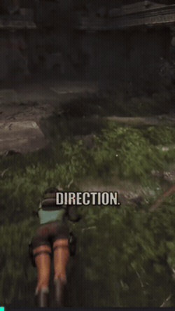
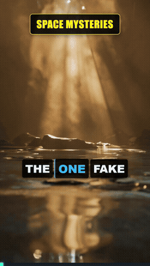
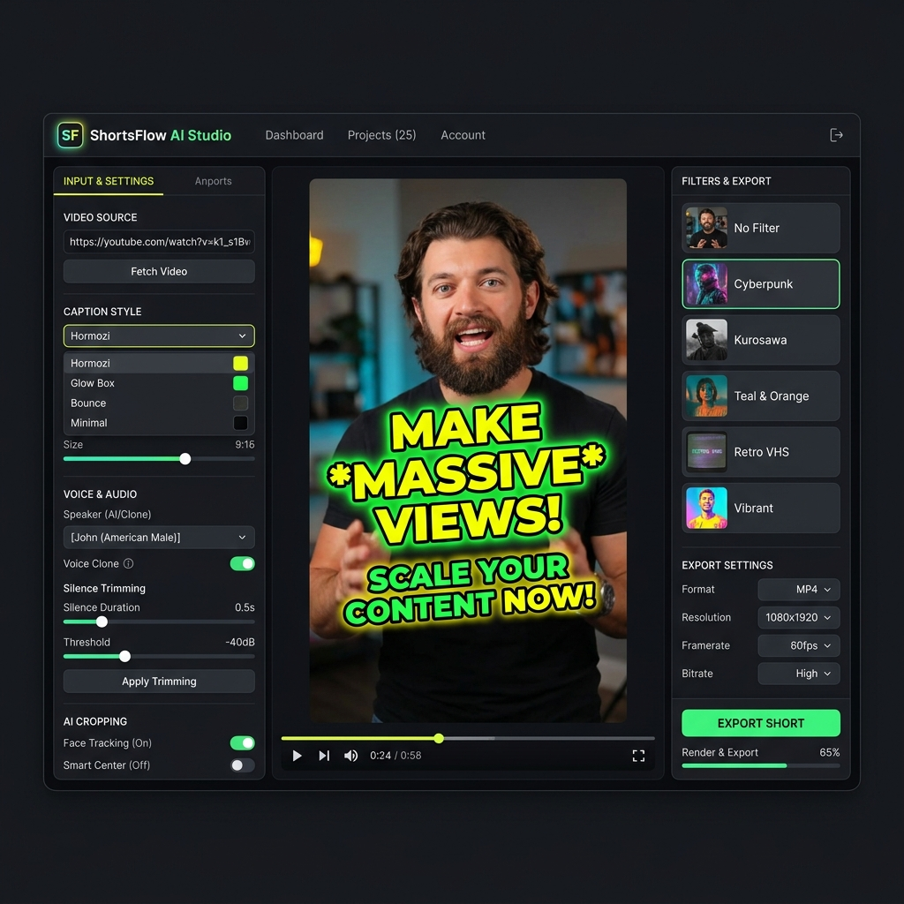

# ⚡ ShortsFlow AI Studio

> **The Open-Source Opus Clip Alternative**  
> Turn YouTube Links, Long Videos, or Text Ideas into High-Retention Shorts & Reels on Autopilot.

<div align="center">
  
  
  
</div>

<p align="center">
  <a href="https://python.org"></a>
  <a href="https://remotion.dev"></a>
  <a href="https://nvidia.com"></a>
  <a href="LICENSE"></a>
</p>

---

## ⚡ Quick Start (60 Seconds)

```bash
# 1. Clone Repo & Navigate
git clone --depth 1 https://github.com/ghost1412/shorts-generator.git
cd shorts-generator

# 2. 1-Click Setup & Launch Desktop Studio GUI
setup.bat && launch.bat
```

> 🐧 **Linux / macOS**: `chmod +x setup.sh && ./setup.sh && python3 gui_app.py`  
> 🐳 **Docker**: `docker compose up -d`

---

## ⚡ ShortsFlow vs Paid SaaS Tools

| Feature | ⚡ ShortsFlow AI Studio (Open Source) | 💳 Paid SaaS ($20–$50/mo) |
|---|---|---|
| **Monthly Cost** | **$0 / 100% Free Forever** | $19 – $49 / month |
| **Data Privacy** | **100% Local GPU / Private** | Uploaded to 3rd party cloud |
| **Creation Modes** | **Clipping + Explainers + Facts + Riddles + Top 5 + Dubbing** | Video clipping only |
| **Subtitle Quality** | **Remotion React Spring Physics (Hormozi, Glow Box, Bounce)** | Basic cloud subtitles |
| **Limits & Watermarks** | **Unlimited Exports & Zero Watermarks** | Credit caps & paid watermarks |

---

## 🖥️ Desktop Studio GUI (`gui_app.py`)

<div align="center">
  
</div>

- **3-Column Single-Window Studio Layout**: Live 9:16 vertical canvas preview, mode picker, preset cards, and 1-click render launcher.
- **Interactive Remotion Presets**: 1-click selection between `HORMOZI`, `GLOW_BOX`, `BOUNCE`, and `MINIMAL` spring captions.

---

## 🎬 Video Generator Modes

| Mode | Visual Format | Quick Command |
| :--- | :--- | :--- |
| ✂️ **AI Clipping** | Slices long YouTube/local videos into high-scoring vertical shorts | `py main.py --source_video "URL" --smart_crop` |
| 🔢 **Top 5 Countdown** | Numbered listicle countdown shorts (#5 ➔ #1) with rank badges | `py main.py --mode TOP_5 --category "inventions"` |
| 💬 **Chat Story** | Animated text message conversation shorts (iMessage format) | `py main.py --mode CHAT_STORY --category "mystery"` |
| 👥 **Podcast** | 2-speaker debate shorts with alternating multi-voice synthesis | `py main.py --mode PODCAST --prompt "AI future"` |
| 🌐 **Video Dubbing** | Multilingual video translation & voice re-synthesis | `py main.py --mode DUB --source_video "clip.mp4" --target_lang es` |
| 🧮 **Manim Explainer** | Programmatic 2D/3D math, CS, and science animations | `py main.py --mode EXPLAINER --prompt "Gravity"` |
| 💡 **AI Facts** | High-energy trivia & mystery facts with scene stock loops | `py main.py --mode FACTS --category "space"` |
| 📖 **AI Story** | Narrative story voiceover with visual scene stitching | `py main.py --mode STORY --category "sci-fi"` |
| 🤔 **This or That (WYR)** | Split-screen dilemma challenge with VS central badge | `py main.py --mode WYR --category "superpowers"` |
| 🏆 **Rank It** | Sequential Tier List (S, A, B, C, D) item ranking reveal | `py main.py --mode RANK_IT --category "supercars"` |
| 🧩 **Emoji Guess** | Interactive emoji puzzle game with animated reveal | `py main.py --mode EMOJI_GUESS --category "movies"` |
| 📰 **News Breakdown** | RSS news headline summary with cartoon personas | `py main.py --mode NEWS --cartoon --persona mafia_cat` |

---

## 🎛️ Engine Power Capabilities

| Capability | Supported Technologies & Flags |
| :--- | :--- |
| 🎙️ **Voice Synthesis & Cloning** | Zero-Shot Voice Cloning (`--clone_voice "sample.wav"`), VoiceStudio Local REST (`--tts_provider voicestudio`), ElevenLabs, EdgeTTS |
| 📐 **Aspect Ratios** | `9:16` (Vertical), `16:9` (Landscape), `1:1` (Square), `4:5` (Social Feed) via `--aspect_ratio` |
| 🔊 **Audio Mastering & SFX** | Auto SFX (`whoosh`, `pop`, `riser`, `boom`), Dynamic BGM Audio Ducking (`--auto_ducking`), Studio Master Filter (`--enhance_audio`) |
| 🎥 **Motion & Visual Filters** | Dynamic Camera Push-In Zoom (`--enable_zoom`), 12 Color Grade Presets (`--video_filter cyberpunk`, `kurosawa`, `teal_orange`) |
| 📦 **Batch Automation** | Automated queue execution from CSV / text lists (`--batch_file "topics.txt"`) |
| 🤖 **Multi-LLM Matrix** | Google Gemini, Local Ollama (`qwen3:8b`), DeepSeek, Groq, Anthropic, OpenRouter (`--llm_provider`) |

---

## 🎨 Visual Color Grading Presets (`--video_filter`)

| Preset Name | Visual Atmosphere | Preset Name | Visual Atmosphere |
| :--- | :--- | :--- | :--- |
| **`dynamic`** | AI auto-switches color grade per scene beat | **`kurosawa`** | Black & White high-contrast samurai |
| **`cyberpunk`** | Neon boosted purples/blues for night sci-fi | **`teal_orange`** | Blockbuster movie cinematic color balance |
| **`cinematic_warm`** | Golden hour warmth for scenery & drama | **`vibrant_action`** | Sharp contrast & saturation for sports/action |
| **`vintage_vhs`** | Analog retro tape scanlines & color shift | **`moody_dark`** | Dark fantasy / horror shadow contrast |

---

## 💡 Top Command Recipes

```bash
# 1. High-Retention Short with Voice Cloning, Zoom Motion & Audio Ducking
py main.py --mode FACTS --category "cyberpunk AI" --tts_provider voicestudio --clone_voice "my_voice.wav" --enable_zoom --auto_ducking --use_remotion

# 2. Render Landscape 16:9 YouTube Video with SFX
py main.py --mode EXPLAINER --prompt "Quantum physics" --aspect_ratio 16:9 --sfx_preset whoosh

# 3. Translate and Dub Video into Spanish
py main.py --mode DUB --source_video "https://www.youtube.com/watch?v=VIDEO_ID" --target_lang es --use_remotion

# 4. Process Batch Content Calendar Queue
py main.py --batch_file "topics.txt" --mode FACTS --aspect_ratio 9:16 --use_remotion
```

---

## ⚙️ Environment Configuration (`.env`)

Rename `env.example` to `.env`:

```env
GEMINI_API_KEY=your_gemini_key_here
HF_API_KEY=your_huggingface_key_here
PEXELS_API_KEY=your_pexels_key_here

# Local Voice Studio & Production Defaults
VOICE_PROVIDER=auto
VOICE_STUDIO_URL=http://localhost:8000/v1/audio/speech
DEFAULT_ASPECT_RATIO=9:16
AUTO_DUCKING=true
```

---

## 🤖 AI Agent Onboarding

If you are an AI Coding Agent (Cursor, Antigravity, Claude Code, Copilot, AutoGPT) onboarding into this codebase, see **[AGENTS.md](AGENTS.md)** for structured architectural context, module maps, CLI skills, and execution rules.

---

## 📄 License
ShortsFlow AI Studio is open-source software licensed under the MIT License.
